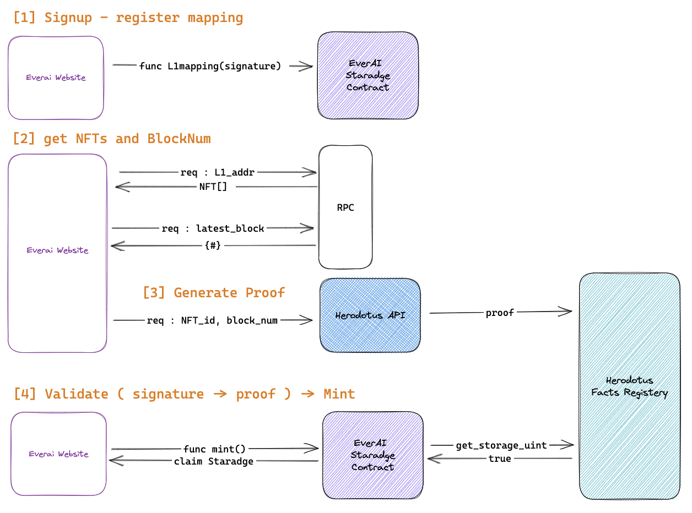

# StarkBadge

# ! UNDER DEVELOPMENT !

Reflect your historical data ( storage proof of ownership storage) into a .

## What is historical data ( storage proof of ownership )?

Historical data is proof of ownership based on past block. It is a record that contains "{#} address is the owner of {#} NFT at block number {#}".

For example, 0x30…83 is the owner of #10 everAi NFT at block number #8893709 in Ethereum.

## What is StarkBadge?

StarkBadge is a L1 historical reflection of the L2 original NFT.The StarkBadge contract has the same functions as the original NFT, but with three differences:

1. It records the exact block number of the proof. You can generate historical data based on any historical block number, and it will be recorded on StarkBadge.
2. To mint a StarkBadge, you need to validate proof. As StarkBadge is a reflection, you need to verify that you hold a token and then have access to claim the reflection.
3. It validates the signature to make sure the right person is calling proof validation. StarkBadge stores the mapping of L1 and L2 wallets so that the right L1 address's proof is sent to the right L2 address. You need to check the mapping before proof validation.

Using the <b>Herodotus API</b>, the historical data you get from L1 can be verified in L2. On the StarkBadge page, you can choose which NFT {#} and which block number you want to make as historical data proof. You can also choose which one you want to claim in L2.

## Technical overview

  
   

## User Flow of StarkBadge App

1. **Sign up**

   1. Connect your L1 wallet and L2 wallet.
   2. Sign a message for your L2 wallet address on your L1 wallet.
   3. Send the signature to the StarkBadge contract to sign up and update the mapping.

2. **Claim **

   0. Get your L1 wallet's NFTs through RPC.
   1. Select the NFT that you want to reflect in L2.
   2. Select the block number that you want to reflect in L2.
      - If there is no block number that has already been claimed, you can create a proof on the latest block.
   3. Check if the information is correct and claim on L2 to get the StarkBadge.

## How can you use StarkBadge?

With StarkBadge, you can use L1 historical data as a condition for certain actions for L2. For example, you can set an airdrop condition in Starknet for those who had everAI between block {#} ~ block {# +100}. Also, you can use StarkBadge for "sign-in-with-everai" in Starknet.
